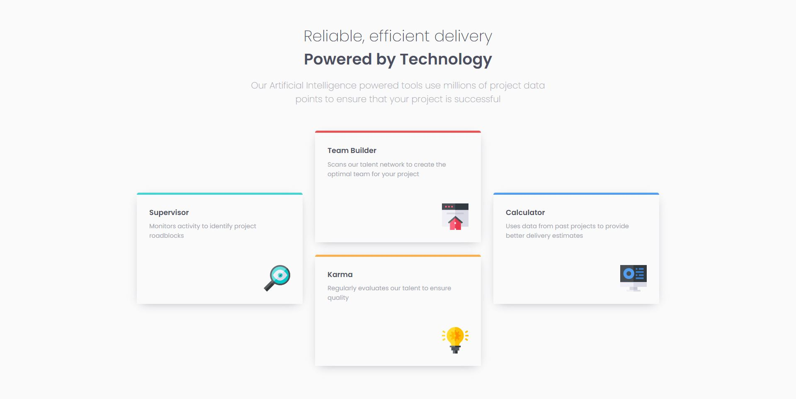

# Frontend Mentor - Four card feature section solution

This is a solution to the [Four card feature section challenge on Frontend Mentor](https://www.frontendmentor.io/challenges/four-card-feature-section-weK1eFYK). Frontend Mentor challenges help you improve your coding skills by building realistic projects. 

## Table of contents

- [Overview](#overview)
  - [Screenshot](#screenshot)
  - [Links](#links)
- [My process](#my-process)
  - [Built with](#built-with)
  - [What I learned](#what-i-learned)
- [Author](#author)

## Overview

### Screenshot

### Links

- Solution URL: [https://github.com/P4ZD4N/four-card-feature-section](https://github.com/P4ZD4N/four-card-feature-section)
- Live Site URL: [https://wiktorcfourcard.vercel.app/](https://wiktorcfourcard.vercel.app/)

## My process

### Built with

- Semantic HTML5 markup
- SASS/SCSS
- BEM
- Flexbox
- Custom CSS Transitions

### What I learned

Doing this challenge I learned:
  - How to use mixins in SASS/SCSS
  - 'order' property from Flexbox

## Author

- GitHub - [@P4ZD4N](https://github.com/P4ZD4N)
- Frontend Mentor - [@P4ZD4N](https://www.frontendmentor.io/profile/P4ZD4N)
